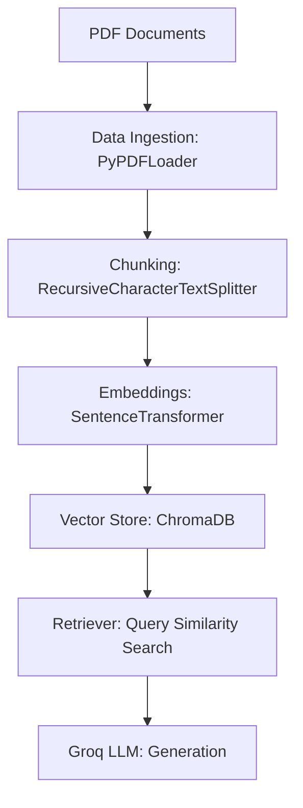

# 📚 Basic RAG Pipeline Demo

This repository demonstrates a **basic Retrieval-Augmented Generation (RAG) pipeline** using LangChain, ChromaDB, Sentence Transformers, and Groq LLM.

---

## 🔹 Pipeline Flow

1. **Data Ingestion**
   - Load PDFs using `PyPDFLoader` / `PyMuPDFLoader`
   - Add metadata (source file, file type)

2. **Chunking**
   - Split documents into smaller chunks with `RecursiveCharacterTextSplitter`
   - Helps improve retrieval and generation performance

3. **Embedding**
   - Convert chunks into vectors using `SentenceTransformer`
   - Each chunk is represented as a semantic embedding

4. **Vector Store**
   - Store embeddings + metadata in **ChromaDB**
   - Enables fast similarity search

5. **Retrieval**
   - Query vector store for relevant chunks
   - Filter results by similarity score

6. **Generation**
   - Use Groq LLM (`llama-3.1-8b-instant`) to generate answers
   - Augment responses with retrieved context

---

## 🔹 Installation

```bash
pip install langchain langchain-text-splitters langchain-groq chromadb sentence-transformers scikit-learn python-dotenv
```

## 🔹 Usage

Place your PDFs inside the data directory.

Run the pipeline script:

-Ingest and chunk documents

-Generate embeddings

-Store them in ChromaDB

Query the retriever with natural language questions.

Get grounded answers from Groq LLM.

## 🔹 Example Query

```code
query = "What are the key points in chapter 2?"
results = rag_retriever.retrieve(query, top_k=5, score_threshold=0.3)

for doc in results:
    print(f"Rank {doc['rank']} | Score: {doc['similarity_score']:.4f}")
    print(f"Content: {doc['content'][:200]}...\n")
```

## 🔹 Notes

--Replace GROQ_API_KEY in your .env file with your actual key.

--Adjust chunk_size and chunk_overlap for optimal retrieval.

--Use llama-3.1-8b-instant for speed, or llama-3.3-70b-versatile for higher reasoning quality.

## 🔹 Pipeline Diagram (Mermaid)



### YOU CAN ALWAYS CHECK THE ENTIRE PROJECT FOR DEEP UNDERSTANDING
